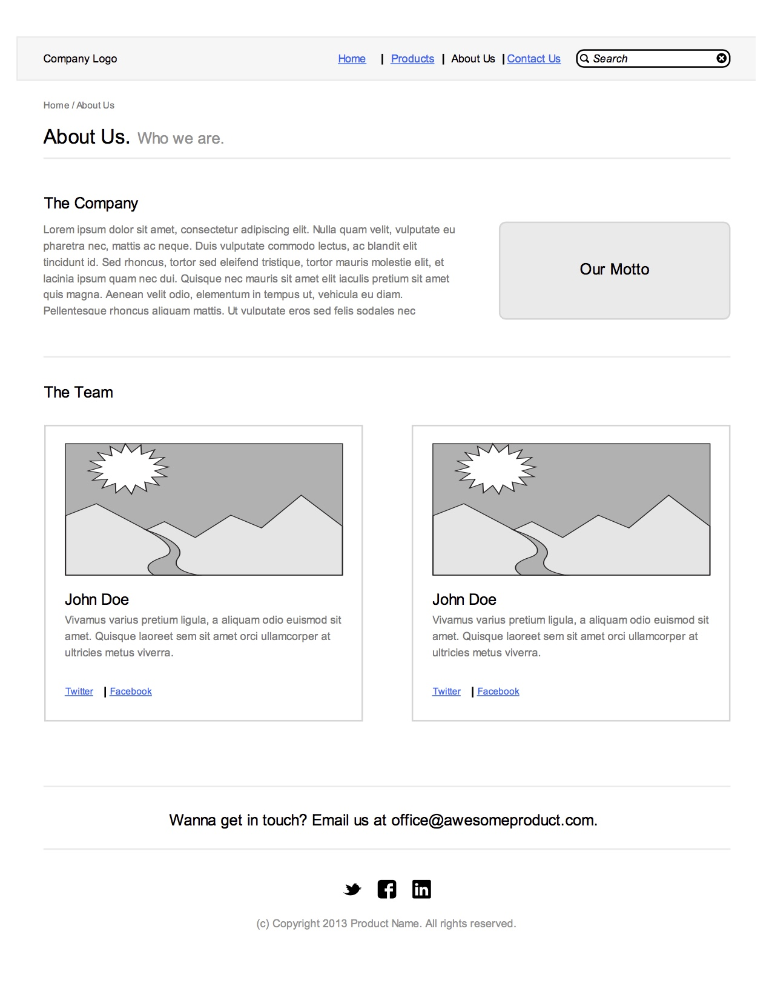

# Mockups Lab

We'd like you to recreate some mockups using Twitter Bootstrap.

## Getting Started

1. For each mockup, create a new HTML page and include Twitter Bootstrap in your head tag (use the snippet we created to make this process even faster!)
2. Since you are not running your code on a server, make sure that you include http:// in all of your bootstrap links
3. Be sure to check your networks tab to ensure that Bootstrap is included and working
4. Now you're ready to start coding!
5. Note that these examples are **mockups**. It's ok if your results are slightly off. Focus most of your time on the positioning of the elements.
5. Use http://lorempixel.com if you need a placeholder for images
6. When you are finished or even if you do not get done in time, make sure to push your code to github

## If you get stuck....

1. Review the notes from today's lecture
2. Check out the [documentation](http://getbootstrap.com/) for Bootstrap

##Mockups

###Mockup 1

###Mockup 2

###Mockup 3

## Bonus

* Now that you've used Bootstrap, add an external stylesheet and make your site look as un-Bootstrappy as possible by overriding styles. While Bootstrap is a great framework for scaffolding ideas quickly, nobody likes a plain-ol-Bootstrap site
